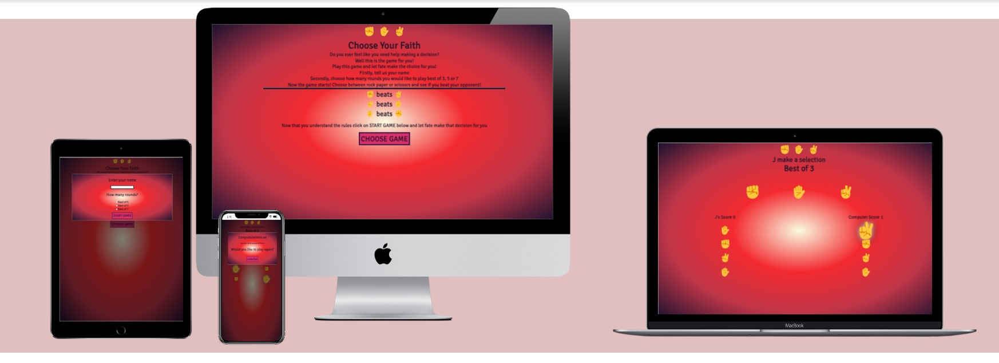
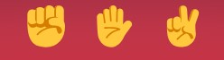
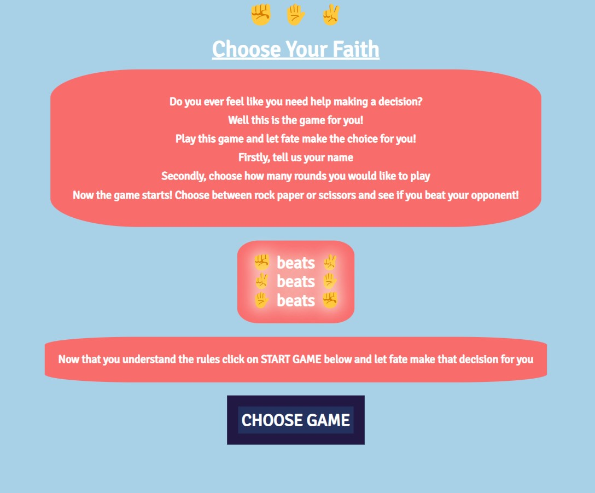
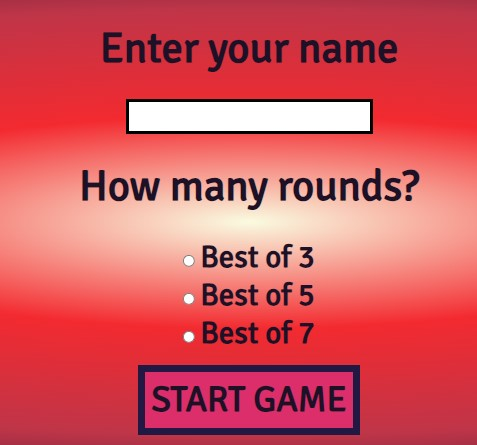
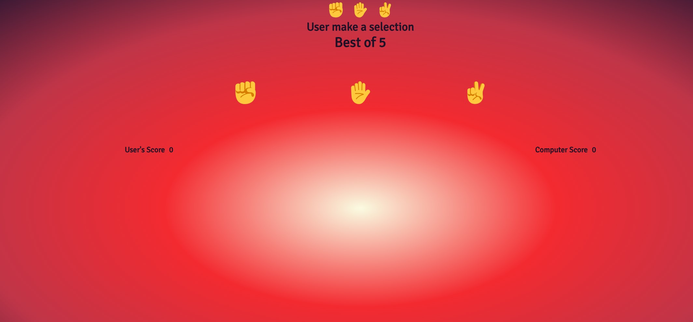
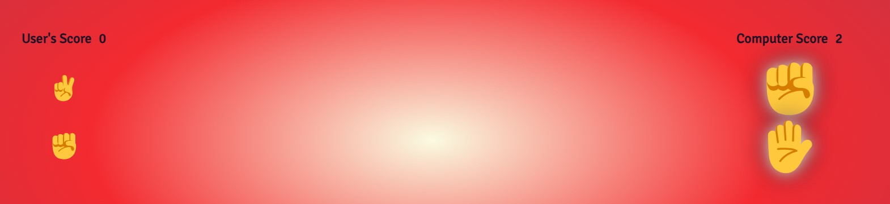
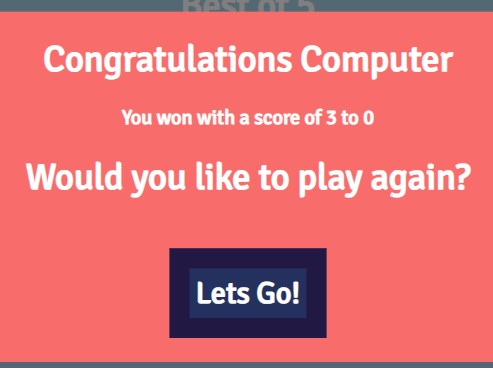
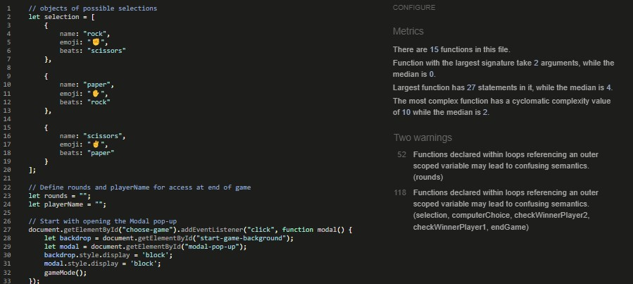

# Introduction

Choose Your Faith is a web based game developed using HTML, CSS and Javascript. It is a basic game of Rock Paper Scissors and is aimed at users who are struggling to make a decision. 

View the live site [https://janisroz.github.io/Rock-Paper-Scissors/](https://janisroz.github.io/Rock-Paper-Scissors/).

## Features

### Site Wide

- Nav Images
    - The rock, paper and scissors emojis are displayed at the head of the site to immediately allow users to understand what the game is

- Central design
    The page is designed in a central column that is centered and is where the JavaScript inserts values into the HTML

### Main Menu

This is the first page that the user will see upon landing the user is greeted with a growing animation of the heading "Choose Your Faith". The site is based around the idea of the user struggling to make a decision in their life. This game seeks to address this issue giving users a way to leave the decision in the hands of faith.

- Introduction Section
    - This section describes the premise of the game, explaining the point of the game and a brief description of what choices they will have regarding the game

- Instruction Section
    - A visual approach was taken to explain the simple rules of the game 

- Start Game Button
    - Once the player is ready to play the user can click on the choose game button starting the game

### Start Game Modal

Modals are used throughout the site to navigate through the game sections and allows for data collection from the user in this section

- Name Section
    - This input section captures the users name, If there is no text entered the user will get an alert instructing them to insert their name

- How Many Rounds 
    - Radio buttons are utilized allowing users to select how many rounds they would like the game to last

- Start Game Button
    - Once this is clicked and both radio and name sections are recorded the game will begin

### Game Section

This is where the main game takes place

- User make a selection
    - This section uses JS to insert the users name into the User placeholder 

- Best of 5
    - The number of rounds are displayed using JS to insert the chosen number from the start game modal.

- Rock Paper Scissors Buttons
    - The user clicks on these buttons to make a selection of their choice 

- Score
    - Player and computer score is updated dynamically using JS and previous choices and winners are displayed upon selection. Winners are highlighted by a glow and increase in size

### End Game Modal

This section is displayed upon ending of the game 

- Congratulations User
    - This section congratulates the winner of the game wether it is the user or computer

- Score section
    - This section uses JS to display the final score

- Play Again Button
    - This button sends the user back to the main page allowing them to play again

## Existing Features

- Responsive design
- Animations used for improved user experience
- Recording of user inputs to choose game type
- Main game and option to restart

## Features for Future Implementation

- Option to play with a friend rather than just against the computer
- A leaderboard could be implemented to allow users to compete against each other

## Testing

### Testing Strategy

Two methods of testing were implemented throughout the development of this website. The first was continuous testing that was carried out throughout the projects. This was utilized in both the JavaScript and also in the CSS. In the CSS testing was continuously performed in order to ensure all elements were as user friendly as possible and adhered to the design scheme. Continuous testing was especially important in the JavaScript and testing was constantly performed in order to ensure that the logic was being executed correctly and all functions were working how and when they were expected. 

The second method of testing was a more formal approach in which the site was brought through validators and other tools in order to ensure all code was iplemented as efficiently and user friendly as possible.

### Validator Testing

- HTML 
    - No errors were found when passing through the official W3C Validator. [View the results here](https://validator.w3.org/nu/?doc=https%3A%2F%2Fjanisroz.github.io%2FRock-Paper-Scissors%2F)

- CSS
    - No errors were returned when passing through the official W3C CSS Validation Service - Jigsaw. [View the results here](https://jigsaw.w3.org/css-validator/validator?uri=https%3A%2F%2Fjanisroz.github.io%2FRock-Paper-Scissors%2F&profile=css3svg&usermedium=all&warning=1&vextwarning=&lang=en)

- JavaScript 
    - No errors were returned when passing through the validator service at JSHint.com.
    

- Wave Accesibilty
