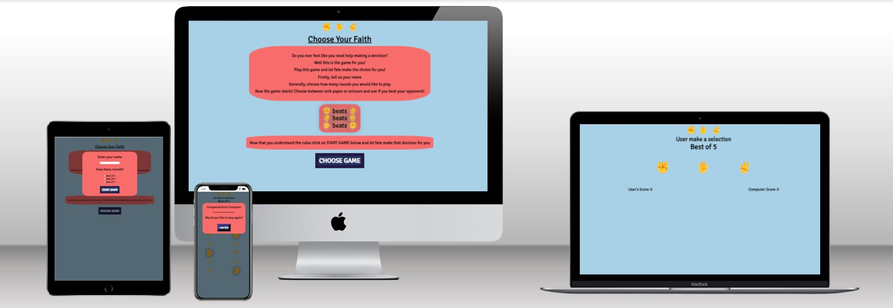
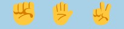
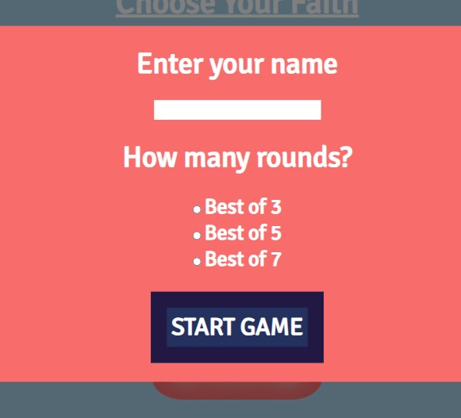
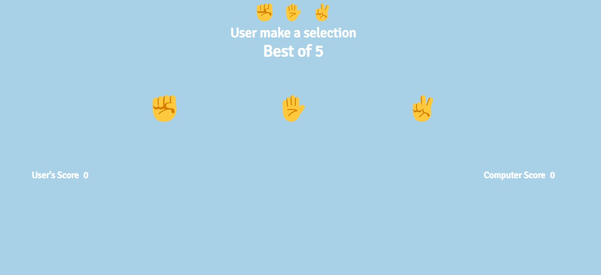
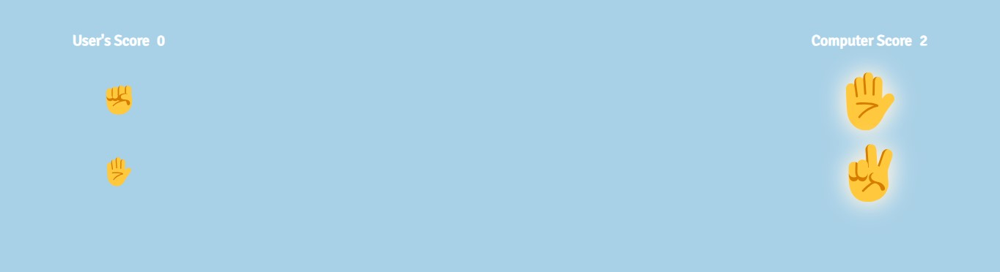
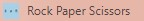

# Introduction

Choose Your Faith is a web based game developed using HTML, CSS and Javascript. It is a basic game of Rock Paper Scissors and is aimed at users who are struggling to make a decision. 

View the live site [https://janisroz.github.io/Rock-Paper-Scissors/](https://janisroz.github.io/Rock-Paper-Scissors/).

## Features

### Site Wide

- Nav Images
    - The rock, paper and scissors emojis are displayed at the head of the site to immediately allow users to understand what the game is

- Central design
    The page is designed in a central column that is centered and is where the JavaScript inserts values into the HTML

### Main Menu

This is the first page that the user will see upon landing the user is greeted with a growing animation of the heading "Choose Your Faith". The site is based around the idea of the user struggling to make a decision in their life. This game seeks to address this issue giving users a way to leave the decision in the hands of faith.

- Introduction Section
    - This section describes the premise of the game, explaining the point of the game and a brief description of what choices they will have regarding the game

- Instruction Section
    - A visual approach was taken to explain the simple rules of the game 

- Start Game Button
    - Once the player is ready to play the user can click on the choose game button starting the game

### Start Game Modal

Modals are used throughout the site to navigate through the game sections and allows for data collection from the user in this section

- Name Section
    - This input section captures the users name, If there is no text entered the user will get an alert instructing them to insert their name

- How Many Rounds 
    - Radio buttons are utilized allowing users to select how many rounds they would like the game to last

- Start Game Button
    - Once this is clicked and both radio and name sections are recorded the game will begin

### Game Section

This is where the main game takes place

- User make a selection
    - This section uses JS to insert the users name into the User placeholder 

- Best of 5
    - The number of rounds are displayed using JS to insert the chosen number from the start game modal.

- Rock Paper Scissors Buttons
    - The user clicks on these buttons to make a selection of their choice 

- Score
    - Player and computer score is updated dynamically using JS and previous choices and winners are displayed upon selection. Winners are highlighted by a glow and increase in size

### End Game Modal

This section is displayed upon end of the game 

- Congratulations User
    - This section congratulates the winner of the game wether it is the user or computer

- Score section
    - This section uses JS to display the final score

- Play Again Button
    - This button sends the user back to the main page allowing them to play again

### Favicon

A favicon was created using [canva](https://www.canva.com/) to allow users to pick out the website when they have multiple tabs open 

## Existing Features

- Responsive design
- Animations used for improved user experience
- Recording of user inputs to choose game type
- Main game and option to restart

## Features for Future Implementation

- Option to play with a friend rather than just against the computer
- A leaderboard could be implemented to allow users to compete against each other

## Technologies

- HTML
    - Website structure and content was developed using HTML 

- CSS
    - Website styling, design and responsiveness was developed using CSS

- FontsFree
    - [https://fontsfree.net/](https://fontsfree.net/) was used to download the Signika Negative font that was used for the headings throughout the site

- Favicon.io

    - [https://favicon.io/](https://favicon.io/) was used to create the favicon image Code Anywhere

- Code Anywhere
    - Code Anywhere was used as the IDE to develop the website

- GitHub
    - GitHub was used to store the source code and also deploy the website on Git Pages

- Git
    - Was used to commit and push code throughout development

## Testing

### Testing Strategy

Two methods of testing were implemented throughout the development of this website. The first was continuous testing that was carried out throughout the projects. This was utilized in both the JavaScript and also in the CSS. In the CSS testing was continuously performed in order to ensure all elements were as user friendly as possible and adhered to the design scheme. Continuous testing was especially important in the JavaScript and testing was constantly performed in order to ensure that the logic was being executed correctly and all functions were working how and when they were expected. 

The second method of testing was a more formal approach in which the site was brought through validators and other tools in order to ensure all code was implemented as efficiently and user friendly as possible.

### Functional Testing

This testing was carried out in order to ensure that the game ran as expected

- On start game click 

    - expected: start game modal to open 
    - result: start game modal opens as expected

- Clicking outside of start game modal

    - expected: start game modal to close 
    - result: start game modal closed as expected

- Clicking Start Game with no inputs

    - expected: alert appears to inform user that name and rounds must be selected
    - result: alert appears

- Clicking Start Game with only name no rounds selected

    - expected: alert appears to inform user that name and rounds must be selected
    - result: alert appears

- Clicking Start Game with only rounds selected and  no name input

    - expected: alert appears to inform user that name and rounds must be selected
    - result: alert appears

- Clicking Start Game with name input and rounds selected 

    - expected: modal closes, game screen appears
    - result: modal closes, game screen appears

- Clicking on either rock paper or scissors input 

    - expected: selection to display below the users score section and computers selection to display below the computers score section. The winner should have larger size and have a glow effect. The scores should update incrementing the winners score by one and not changing for the loser or in the case of a draw 
    - result: all returned as expected

- Reaching the score that the user chose 

    - expected: when score is reached depending on the number of rounds selected the end game modal should appear informing the user of who won and the end score.
    - result: end game modal is displayed and scores and winner are displayed correctly

- Clicking on lets go button

    - expected: page is reloaded and user is brought back to start screen allowing them to play again
    - result: page reloads succesfully

### Responsiveness

All stages of the website were constantly tested throughout development to ensure responsiveness was maintained throughout from the screen width of 280px and up. The site was tested on Chrome, Firefox and Opera browsers

- The website was also tested across multiple mobile devices to ensure responsivity remained consistent throughout

### Validator Testing

- HTML 
    - No errors were found when passing through the official W3C Validator. [View the results here](https://validator.w3.org/nu/?doc=https%3A%2F%2Fjanisroz.github.io%2FRock-Paper-Scissors%2F)

- CSS
    - No errors were returned when passing through the official W3C CSS Validation Service - Jigsaw. [View the results here](https://jigsaw.w3.org/css-validator/validator?uri=https%3A%2F%2Fjanisroz.github.io%2FRock-Paper-Scissors%2F&profile=css3svg&usermedium=all&warning=1&vextwarning=&lang=en)

- JavaScript 
    - No errors were returned when passing through the validator service at JSHint.com.
    - Warnings were returned when looping through user input options as taught in the code institute content
    

- Wave Accesibilty
    - No errors were returned when passing through the Wave web accesibility tool. [View the results here](https://wave.webaim.org/report#/https://janisroz.github.io/Rock-Paper-Scissors/)

## Deployment

### Version Control

The website was created using the Code Anywhere IDE and was pushed to the github repository "rock-paper-scissors".

Git commands were used to push code to the remote repository:

- `git add <file>` was used to add a file or multiple files to the staging area
- `git commit -m "commit detail"` was used to commit changes to the local repository queue before being pushed to github
- `git push` was used to push all commited code and files to the repository on gihub

### Deployment to Github Pages

Github pages was used to deploy the website. Steps to deployment are as follows:

- Click on the settings button within the required repository
- Click on the "Pages" tab in the settings page in the menu on the left
- Select "main" branch from the branch dropdown menu
- Click "Save"
- The link will appear at the top of the page once the website is deployed
- The live website can be found here: https://janisroz.github.io/Rock-Paper-Scissors/

### To Clone the Repository Code Locally
- Begin in the required repository
- Click on the green code drop down button and select local
- Copy the repository link to the clipboard
- Using an IDE with pre-installed git type git clone copied-git-url into the IDE terminal
- The project will now be cloned on your IDE to use

## Credits

- favicon creation steps were taken from the DeeMc youtube channel- [favicon creation steps were taken from the DeeMc youtube channel- https://www.youtube.com/watch?v=W809I-d9xTg&ab_channel=DeeMc](https://www.youtube.com/watch?v=W809I-d9xTg&ab_channel=DeeMc)

### Content
- I created the favicon using [canva](https://www.canva.com/)